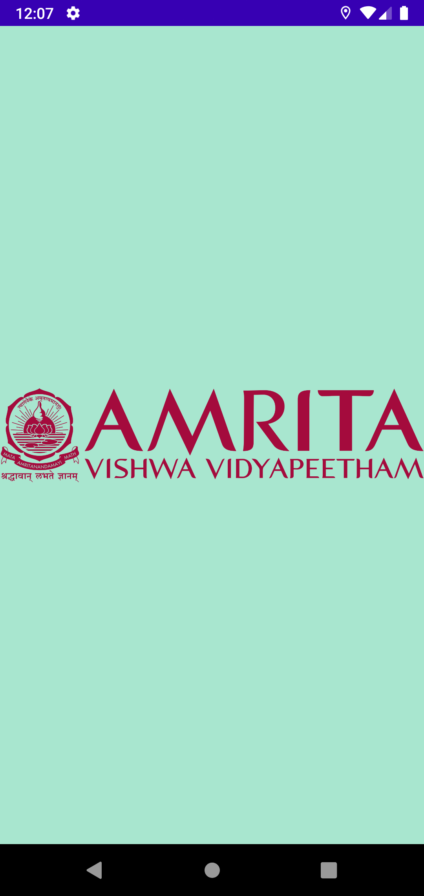
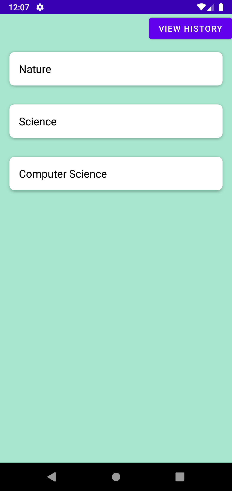
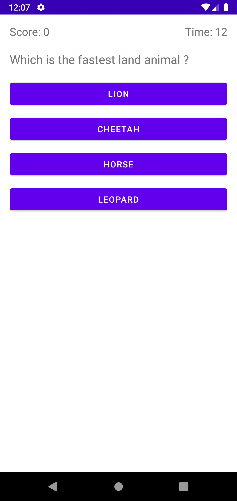
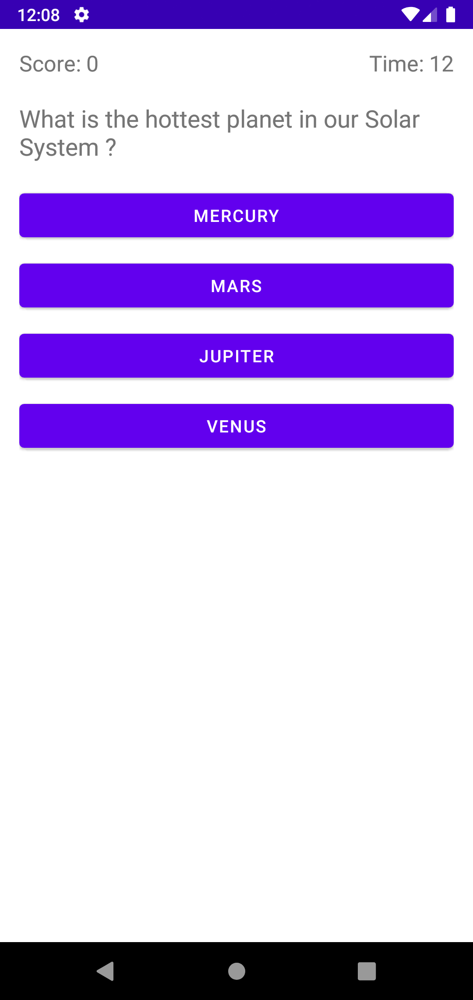
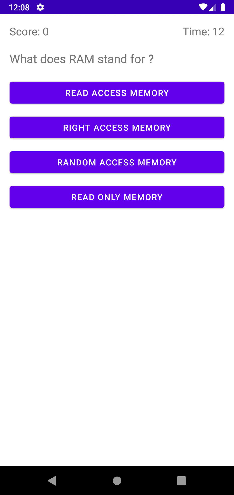
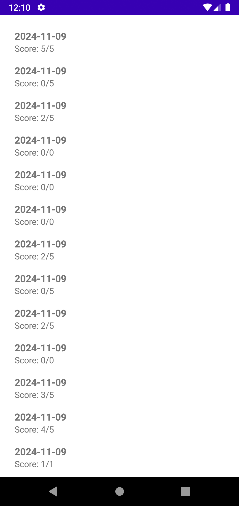

# EnlightenEd - A Quiz Application

## Description

EnlightenEd is an interactive quiz application that allows users to take quizzes on different topics like Nature, Science, and Computer Science. The app fetches questions from Firebase Firestore, displays them in a multiple-choice format, and tracks the user's score in real-time. It also maintains a history of previous quiz attempts. The app has a visually appealing design with a simple user interface that ensures a smooth and engaging user experience.

---

## Features

### 1. **Flash Screen**
   - Displays the **Amrita logo** on a light green background.
   - The logo is shown for 2 seconds before transitioning to the Home Screen.

### 2. **Home Screen**
   - Displays a list of **three topics** : Nature, Science, and Computer Science.
   - Each topic is shown in a card format with a light green background.
   - On clicking any card, the user is taken to the **Quiz Screen** for the selected topic.
   - A button on the top right leads to the **History Screen** to view past quiz results.

### 3. **Quiz Screen**
   - Displays a **random set of 5 questions** fetched from Firebase Firestore.
   - Each question has **4 multiple-choice options**.
   - Includes a **15-second countdown timer** for each question.
     - If the timer runs out, the question is automatically skipped.
     - The user can select only one answer, and once selected, the other options are disabled.
   - Displays a **score tracker** that updates as the user progresses through the quiz.

### 4. **Score Summary Screen**
   - Displays the user’s **score** as a percentage and shows the number of correct answers out of the total questions answered.
   - The score is saved along with the **date** in Firebase as **history**.
   - Includes two options:
     - **Play Again** : Restarts the quiz.
     - **View History** : Leads to the **History Screen** to view previous scores.

### 5. **History Screen**
   - Displays a list of the user’s past scores and quiz dates, fetched from Firebase.
   - This screen provides a history of the user's performance in the quizzes.

## Screenshots

### 1. **Flash Screen**

### 2. **Home Screen**

### 3. **Quiz Screen**

### 4. **Score Summary Screen**

### 5. **History Screen**

